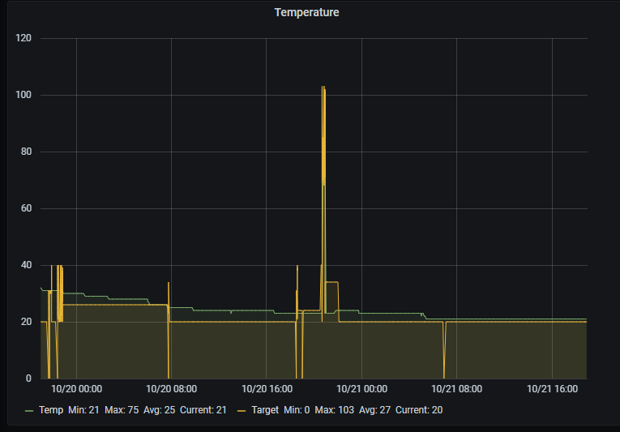

You have to install HACS/nodered to be able to make Homeassistant sensors in Nodered.
Edit all inputs (to the left) and all outputs (to the right) to fit your setup.
Add an entity card in lovelace and add sensors/switches. You need to make your own slider by using Configuration/helpers/numeric slider in order to add it to the card.
 
Grafana example below  
 
