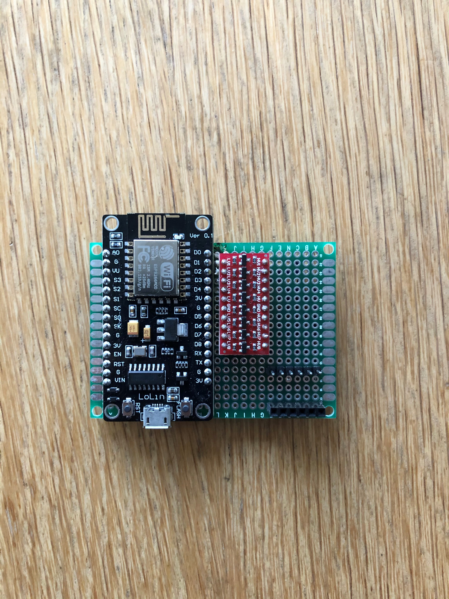
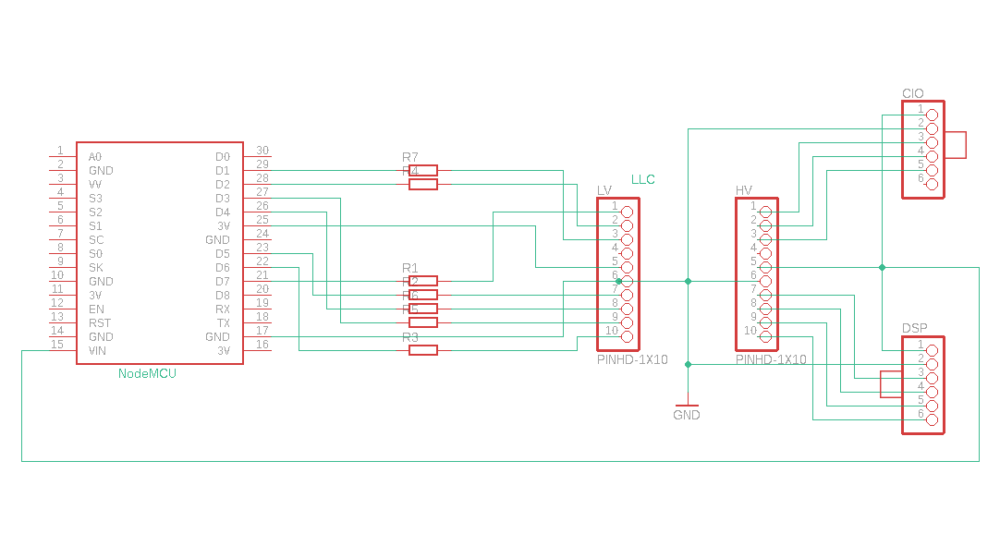

# WiFi-remote-for-Bestway-Lay-Z-SPA (including 2021 year model)
## Hack - ESP8266 as WiFi remote control for Bestway Lay-Z spa Helsinki 
### Disclaimer: As mentioned, this is a hack. If anything breaks it breaks and it's your fault. 
### Caution - unplug mains power to the pump before trying to replicate this hack, or you can die!   
### News: To enable 2021 support, you just need to comment out one line in the file BWC_8266_globals.h. It is (in addition to hardcode in globals.h) possible to set/change MQTT credentials via web interface.
The ESPDateTime library is updated which broke timezones in my code. I decided to omit that config. So device is using UTC only. Web pages will most likely translate to local time. It should only affect MQTT. I think.  
Keeping track of versions has been increasingly difficult over the time.
Arduino is really nice and I will still use it, but it has its limits.
To mitigate this problem I decided to move to another platform:
Visual Studio Code (free) with PlatformIO extension (free)
This way I can sync my local files with github, and hopefully use version numbering more correctly.
I'll keep present Arduino files as a separate branch "Backup" until further.
My plan is that future updates (if any) will be made to "development" branch, and pulled to "master" when I think it's time. 

After downloading and unpacking the files, you can open VSCode, click on PlatformIO icon and open a project folder. Either "4-wire-version" or "6-wire-version". Edit the file "platformio.ini" to your liking. Upload program then upload filesystem. 

If you still want to use Arduino, just rename "main.cpp" to "src.ino" (or "src-for-mqtt.ino" etc. It must have the same name as the parent directory) then move "data" folder to the same folder: 
--my source folder 
&nbsp;&nbsp;|-my source folder.ino 
&nbsp;&nbsp;|--data 
&nbsp;&nbsp;&nbsp;&nbsp;|-index.html 
&nbsp;&nbsp;&nbsp;&nbsp;|-... 
Install libraries listed in "platformio.ini" 

4-wire version: Only tested by me with the pump "on the bench".
  

### Features: 
-Watch the temperature and status from your browser. 
-Custom text on the SPA pump display. 
-Custom sound instead of just beeping is possible. 
-OTA: Update firmware over the air. Super convenient when mounted inside the pump. 
-Simple to build. No hardware changes needed on the SPA pump. Just remove the display, disconnect the 6-pin ribbon cable and plug it into this device. 
-Timer for chlorine. Hit the button on the webpage when adding cl and it will count the days for you. 
-Timer for filter change. Pulled from @Bankaifan. 
-Electricity cost estimation and more 
-MQTT support! I have it installed and working with a Raspberry Pi 4 B with Docker/Mosquitto/grafana/influxdb. Thanks to faboaic and 877dev for MQTT support! Now you can control the SPA from Home assistant etc. 
-Schedule events like heater on/off at specific dates, with repeat functionality. 
-Listen to input signal on one pin and trigger a signal on another pin on desired events. For instance let solar panels turn on/off heater. 
 
### BOM: 
-ESP8266 NodeMCU 1.0 (This version is NOT for ESP32) 
-8 channel bidirectional level converter 
-6 pin male header (0.1 in spacing) or better: JST-SM Housing Connector 
-6 pin female header (JST-SM Housing Connector) 
see build instructions for more info.

### If you like this project, please consider a donation: <a href="Http://PayPal.me/TLandahl">PayPal.me/TLandahl</a> 
 Current web interface 
 
 
 My device and pump 

 
 My schematics 
 

### Installation: 

Link to Eric's PCB (use with LLC below, choose 1x8 ch or 2x4 ch according to the PCB): https://easyeda.com/Naesstrom/lay-z-spa_remote  
 
Link to my version of the PCB (use with LLC below): https://oshwlab.com/Visualapproach/bestway-wifi-controller  
 
Open the project in editor and download gerber files. Upload them to a PCB factory like JLCPCB.com.  
Technical details in https://github.com/visualapproach/WiFi-remote-for-Bestway-Lay-Z-SPA/blob/master/bwc_docs.xlsx  
Build instructions and more: https://sway.office.com/yYbGW1X7YItzwXVx?ref=Link  

Problems? Read FAQ in discussions and current issues
