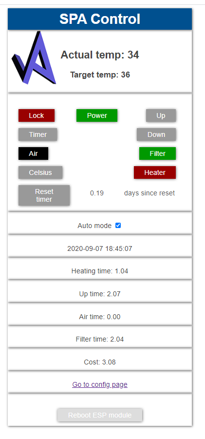
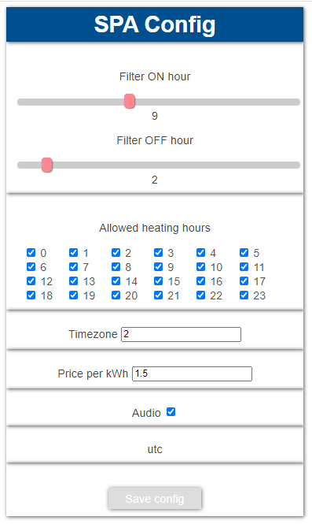

# WiFi-remote-for-Bestway-Lay-Z-SPA
## Hack - ESP8266 as WiFi remote control for Bestway Lay-Z spa Helsinki 
### Disclaimer: As mentioned, this is a hack. If anything breaks it breaks and it's your fault. 
### Caution - unplug mains power to the pump before trying to replicate this hack, or you can die!  
 
Features: 
-Watch the temperature and status from your browser. 
-Custom text on the SPA pump display. 
-Custom sound instead of just beeping. Plays a melody when starting etc. 
-Basic logging to LittleFS (on the ESP8266). See accumulated heating time etc. 
-Update firmware over the air 
-Simple to build. No hardware changes needed on the SPA pump. Just remove the display, disconnect the 6-pin ribbon cable and plug it into this device. 
-Timer for clorine 
-Electricity cost estimation and more 
 
BOM: 
-ESP8266 NodeMCU 1.0 (This version is NOT for ESP32) 
-8 channel bidirectional level converter 
-6 pin male header (0.1 in spacing) or better: JST-SM Housing Connector 
-6 pin female header (JST-SM Housing Connector) 
-Optionally 7 x 500 to 820 Ohm resistors (lower than 500 would not protect against over current which may or may not occur if both sides drives the line in opposite directions. That is not suppose to happen but just in case. So, if you only have say 430 Ohms resistors you may as well skip them. Higher than 820 Ohms can make it not work.)  

### If you like this project, please consider a donation: <a href="Http://PayPal.me/TLandahl">PayPal.me/TLandahl</a> 
 Current web interface 
 
 
 My device 
 
 My pump 
 
 My schematics 
 

Technical details in https://github.com/visualapproach/WiFi-remote-for-Bestway-Lay-Z-SPA/blob/master/github-bestwayhackdocs_.xlsx

Usage: 

   To remove the log file, go to webadress IP/remove.html
   To look at the log file, go to webadress IP/eventlog.csv
   To upload a file to the filesystem, go to webadress IP/upload.html
   To check last reboot time, go to IP/tmp.txt
   "IP" is the local IP of the ESP.

   The main web page "SPA control" should be easy to understand since it mimics the pump display panel. Sort of.
   Use the UP/DOWN buttons to change the temp.

   The "reset timer" is meant to be pressed when new chlorine is added. That way you know when it's time to do it again. It will turn red after a week.

   To force Access Point-mode, where you enter your Wi-Fi credentials, press "C/F" and then POWER on the pump. I thought this key combination would be unusual enough to
   not trigger AP mode accidentally. Not that it hurts anything, but it might be annoying, and leaves an open wifi for a short time. This should not be necessary though since the device goes into automatic AP mode if no WiFi connection exists.

 * v1.27
 * Reworked code
 * Switched to LittleFS since SPIFFS is deprecated
 * SPA control page shows stats and ESP can be rebooted
 * New SPA config page
 * Selectable auto events
 * Audio on/off
 * 
 * Config: filter on/off turns the filter on and off. It remembers last state when turning on.
 * Allowed heater hours: Intended to protect main fuses to pop when you come home from work and turn on every gadget you own...
 * When auto mode is on the heater is turned off on theese hours, and you will not be able to turn it on manually.
 * 
 * In absense of mr Frankenstein, I took the artistic freedom to add my logo/avatar ;-). I bet you will replace it.

