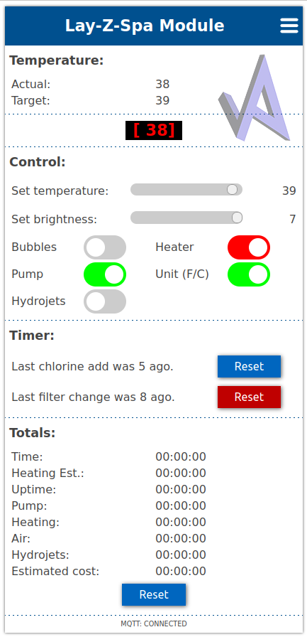
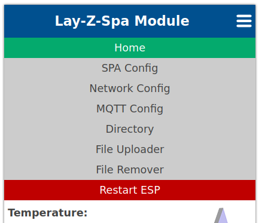
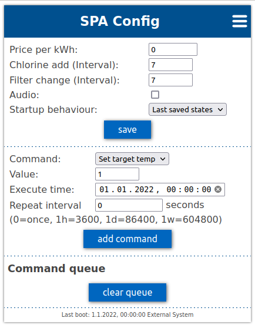
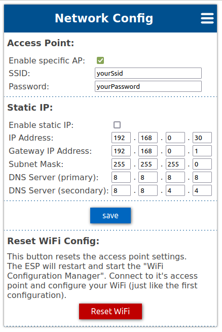
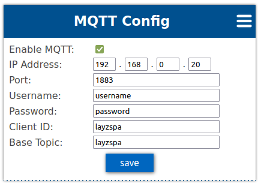

WiFi-remote-for-Bestway-Lay-Z-SPA
=================================
ESP8266 hack to use as WiFi remote control for Bestway Lay-Z-Spa Whirlpools (including 2021 year models) 

For the moment, something in the toolchain is broken. Work in progress...

- [Features](#features)
- [BOM](#bom)
- [Web Interface](#web-interface)
- [WiFi Module / Pump](#wifi-module--pump)
- [Schematics](#schematics)
- [Installation](#installation)
- [Installation (Alternative)](#installation-alternative)
- [Problems?](#problems)

---

> #### Disclaimer
> As mentioned, this is a hack. If anything breaks it is your fault.

> #### Caution
> Pull out the mains plug before modifying hardware, or you can die!

> #### Donate
> If you like this project, please consider a donation. [Buy me a coffee](https://paypal.me/TLandahl), thanks!

#### Features
- Control buttons, watch the temperature and get current states from your browser.
- Custom text on the SPA pump display.
- Custom sound instead of just beeping is possible.
- OTA: Update firmware "over the air". Super convenient when mounted inside the pump.
- Simple to build. No hardware changes needed on the SPA pump. Just remove the display, disconnect the 6- or 4-pin ribbon cable and plug it into this device.
- Timer for chlorine addition and filter change. Hit the button on the web interface and it will count the days for you. (@Bankaifan)
- Electricity cost estimation and more..
- MQTT support! Now you can control the SPA from Home Assistant, OpenHab etc. (@faboaic, @877dev)
- Schedule events like heater on/off at specific dates, with repeat functionality.
- Listen to input signal on one pin and trigger a signal on another pin on desired events. For instance let solar panels turn on/off heater.

#### BOM
- ESP8266 NodeMCU 1.0 **(NOT for ESP32)**
- 8 channel bidirectional level converter
- 6 or 4 pin male header (0.1 in spacing) or better: JST-SM Housing Connector
- 6 or 4 pin female header (JST-SM Housing Connector)
see build instructions for more info.

#### Web Interface
 
 
 
 

#### WiFi Module / Pump
 

#### Schematics

#### Installation
Link to my version of the PCB (use with LLC below): 
[oshwlab.com](https://oshwlab.com/Visualapproach/bestway-wifi-controller) | [easyeda.com](https://easyeda.com/Visualapproach/bestway-wifi-controller) 

Open the project in editor and download gerber files. 
Upload them to a PCB factory like [JLCPCB](https://jlcpcb.com/). 
Technical details in the [Documentation](bwc_docs.xlsx).
Build instructions and more: [Instructions](Build-instructions-Bestway-WiFi-remote.pdf)

 

#### Installation (Alternative)
[Eric's PCB](https://easyeda.com/Naesstrom/lay-z-spa_remote) (use with LLC below, choose 1x8 ch or 2x4 ch according to the PCB). 
Replace the resistors with wires. They cause more problems than they solve. 

 

#### Problems?
Read the [FAQ](https://github.com/visualapproach/WiFi-remote-for-Bestway-Lay-Z-SPA/discussions/46), other [discussions](https://github.com/visualapproach/WiFi-remote-for-Bestway-Lay-Z-SPA/discussions) and current [issues](https://github.com/visualapproach/WiFi-remote-for-Bestway-Lay-Z-SPA/issues).
