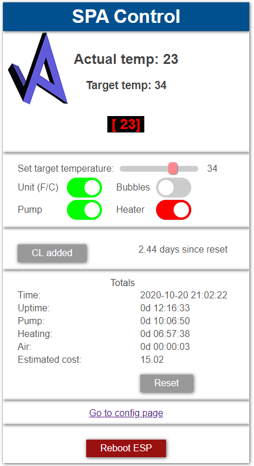
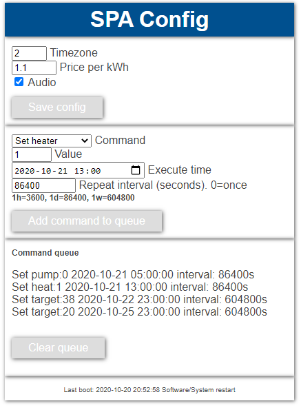
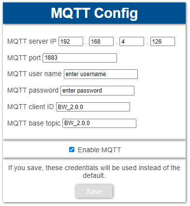
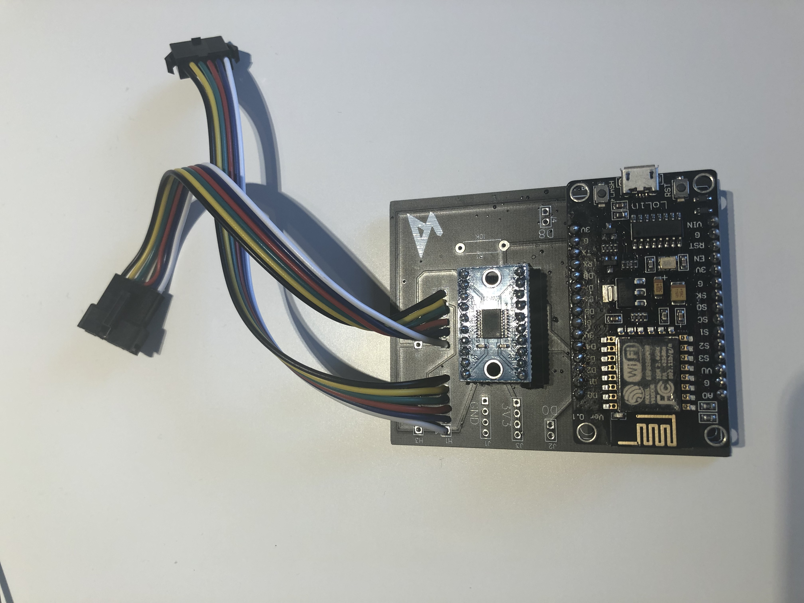
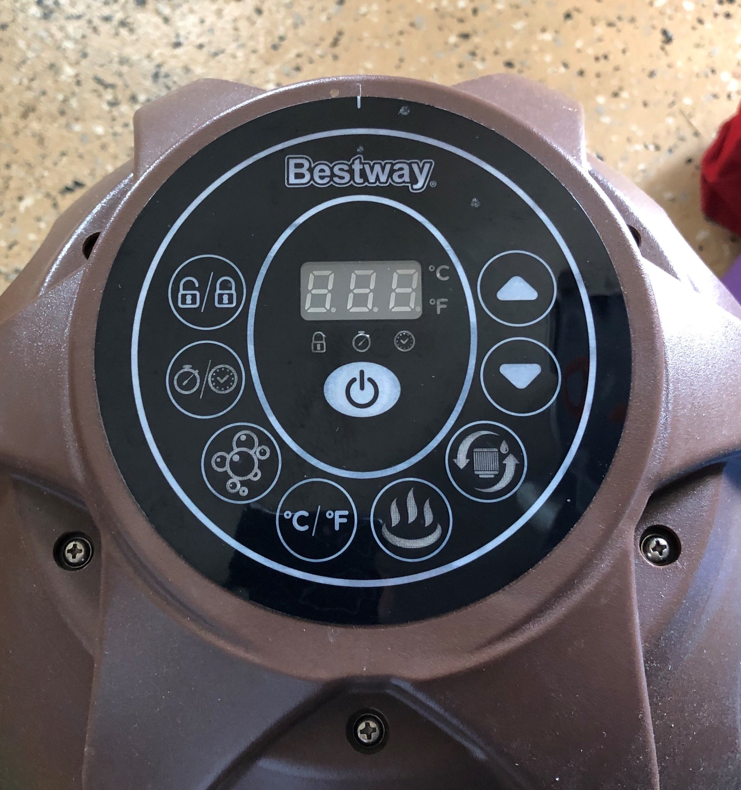
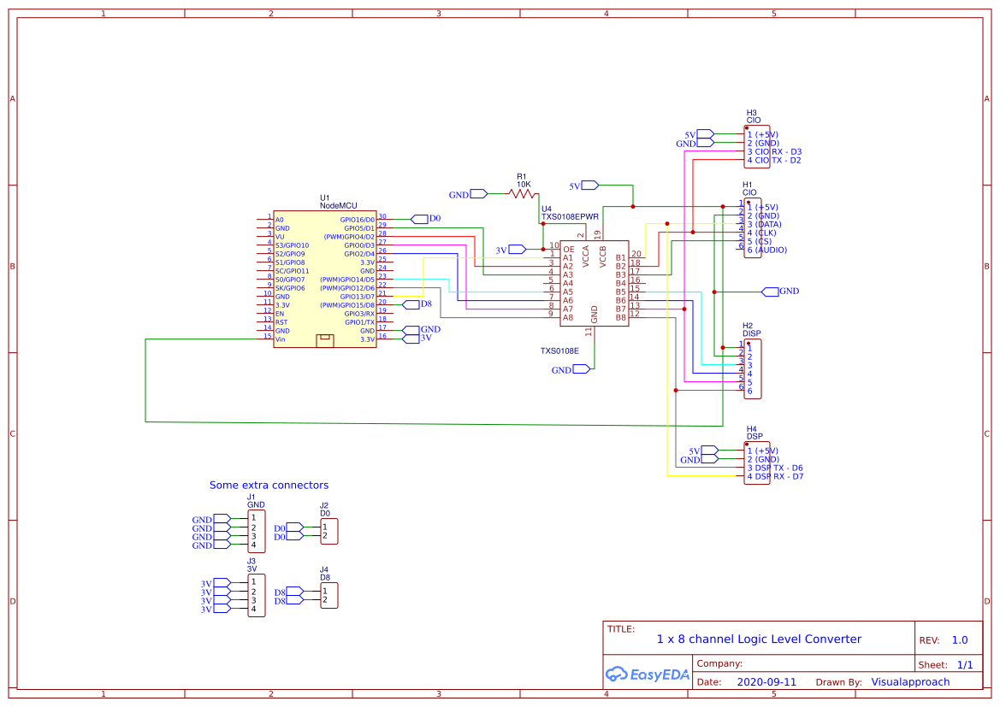
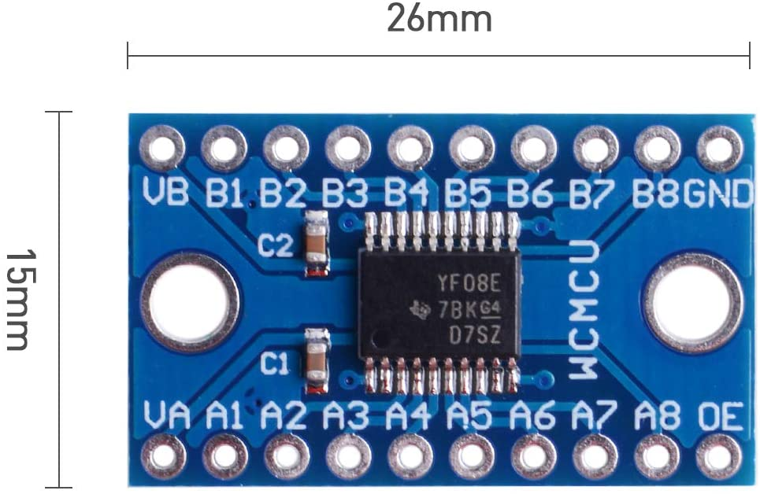
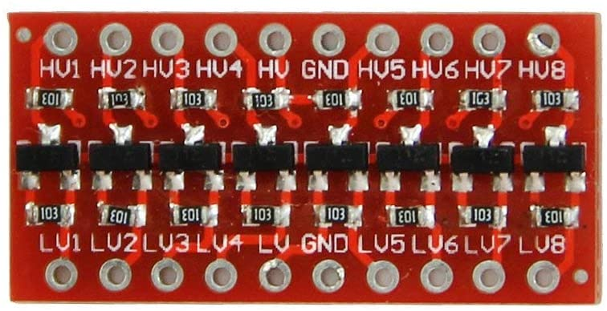

DEV VERSION MOMENTARILY NOT STABLE

# WiFi-remote-for-Bestway-Lay-Z-SPA (including 2021 year model)
## Hack - ESP8266 as WiFi remote control for Bestway Lay-Z spa Helsinki 
### Disclaimer: As mentioned, this is a hack. If anything breaks it breaks and it's your fault. 
### Caution - Unplug mains power to the pump before trying to replicate this hack, or you can die!   

### Features: 
-Watch the temperature and status from your browser. 
-Custom text on the SPA pump display. 
-Custom sound instead of just beeping is possible. 
-OTA: Update firmware over the air. Super convenient when mounted inside the pump. 
-Simple to build. No hardware changes needed on the SPA pump. Just remove the display, disconnect the 6- or 4-pin ribbon cable and plug it into this device. 
-Timer for chlorine. Hit the button on the webpage when adding cl and it will count the days for you. 
-Timer for filter change. Pulled from @Bankaifan. 
-Electricity cost estimation and more 
-MQTT support! I have it installed and working with a Raspberry Pi 4 B with Home Assistant. Thanks to faboaic and 877dev for MQTT support! Now you can control the SPA from Home assistant etc. 
-Schedule events like heater on/off at specific dates, with repeat functionality. 
-Listen to input signal on one pin and trigger a signal on another pin on desired events. For instance let solar panels turn on/off heater. 
 
### BOM: 
-ESP8266 NodeMCU 1.0 (This version is NOT for ESP32) 
-8 channel bidirectional level converter 
-6 or 4 pin male header (0.1 in spacing) or better: JST-SM Housing Connector 
-6 or 4 pin female header (JST-SM Housing Connector) 
see build instructions for more info.

### If you like this project, please consider a donation: <a href="Http://PayPal.me/TLandahl">Buy me a coffee</a> 
 Current web interface 
 

 
 My device and pump 

 
 My schematics 
 

### Installation: 

Link to my version of the PCB (use with LLC below):  
https://oshwlab.com/Visualapproach/bestway-wifi-controller  
https://easyeda.com/Visualapproach/bestway-wifi-controller  
 
Open the project in editor and download gerber files. Upload them to a PCB factory like JLCPCB.com.  
Technical details in <a href="./bwc_docs.xlsx">Documentation</a>  
Build instructions and more: <a href="./Build-instructions-Bestway-WiFi-remote.pdf">Instructions</a>   

Alternative PCB: Eric's PCB (use with LLC below, choose 1x8 ch or 2x4 ch according to the PCB): https://easyeda.com/Naesstrom/lay-z-spa_remote  
Replace the resistors with wires. They cause more problems than they solve. 
 

Problems? Read <a href="https://github.com/visualapproach/WiFi-remote-for-Bestway-Lay-Z-SPA/discussions/46">FAQ</a> and other discussions and current issues
